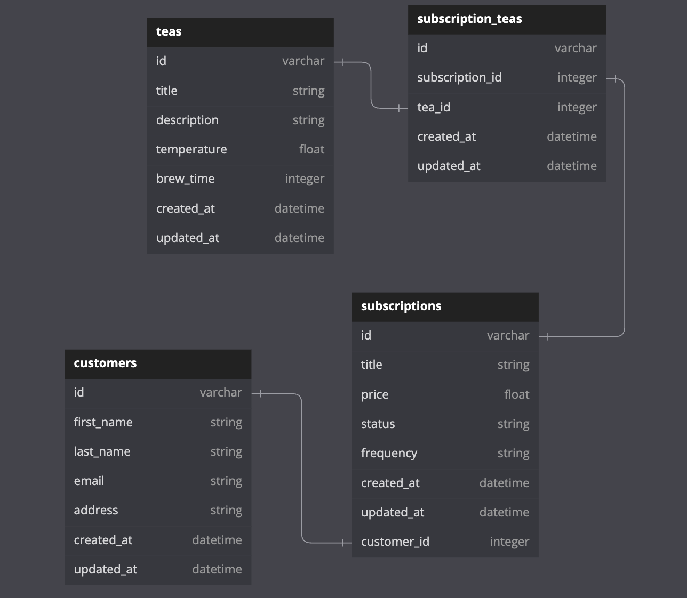

## Tea-Subscription API Service
This BE API is intended for the simple usage of managing tea subscriptions for customers. There are only a few models including the customer, subscription, and tea, that are tied together with a many-to-many relationship model of subscription_tea. 

- Customers are able to subscribe to a tea subscription which would create a custom subscription for that customer with a status on whether it is active or cancelled
- Teas are able to be added to the subscriptions, thus creating subscription_tea objects



## Set-Up
1. Before running this application on a server, the gemfile needs to be activated with the command of `bundle install`
2. `rails db:{drop,create,migrate,seed}` will need to be used for establishing the databases as well as starting initial seeds for developers or users
3. To life-test this API service, it is recommended to use [Postman](https://www.postman.com/) after running `rails s` to navigate the endpoints

## Endpoints
It is recommended to place your parameters in with Postman using raw JSON as the body text.

**POST   /api/v0/subscribe** 
- This endpoint will create a new subscription for a specific customer and requires the parameters of the customer_id and subscription_id
- Input syntax in raw JSON:
```   
{
  "subscription_id": "your_subscription_id_here",      
  "customer_id": "your_customer_id_here"
}
```

- Response:
```
{
    "message": "Subscription added!"
}
```

**PATCH  /api/v0/unsubscribe** - This endpoint will update the subscription by unsubscribing the customer simply by changing the status to "cancelled" and requires the parameters of the customer_id and subscription_id

- Input syntax in raw JSON:
```   
{
  "subscription_id": "your_subscription_id_here",      
  "customer_id": "your_customer_id_here"
}
```

- Response:
```
{
    "message": "Subscription cancelled!"
}
```

**GET    /api/v0/subscriptions** - This endpoint will return the subscriptions whether active or cancelled of a specific customer and requires only the customer_id

- Input syntax in raw JSON:
```   
{
  "customer_id": "your_customer_id_here"
}
```

- Response:
```
{
    "data": [
        {
            "id": "2",
            "type": "subscription",
            "attributes": {
                "id": 2,
                "title": "Platinum",
                "price": 13.7,
                "status": "cancelled",
                "frequency": "daily"
            }
        }
    ]
}
```

**POST   /api/v0/subscribe_tea** - This endpoint will add a tea to an existing subscription and requires the parameters of the tea_id and subscription_id

- Input syntax in raw JSON:
```   
{
  "subscription_id": "your_subscription_id_here",      
  "tea_id": "your_tea_id_here"
}
```

- Response:
```
{
    "message": "Subscription added!"
}
```
